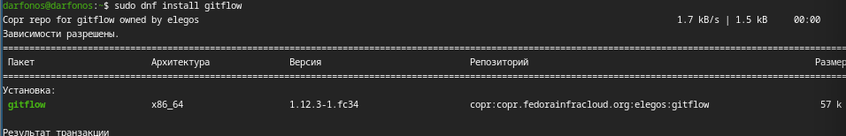
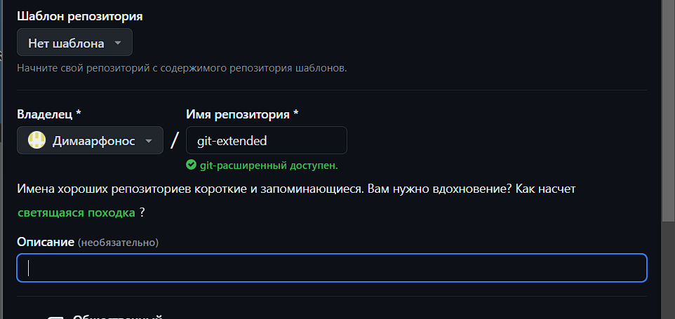
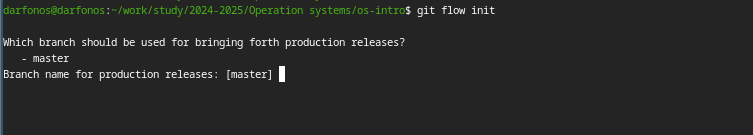
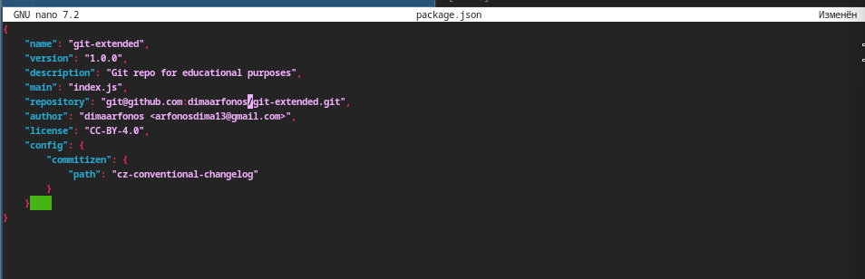
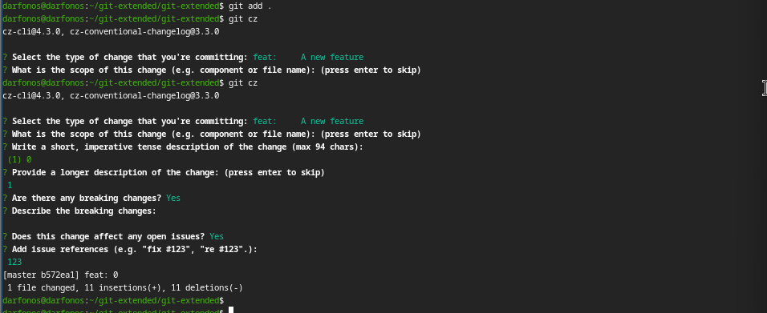
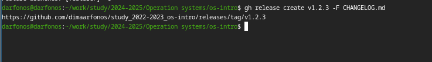

---
## Front matter
lang: ru-RU
title: Структура научной презентации
subtitle: Простейший шаблон
author:
  - Арфонос Дмитрий.
institute:
  - Российский университет дружбы народов, Москва, Россия
date: 9 марта 2024

## i18n babel
babel-lang: russian
babel-otherlangs: english

## Formatting pdf
toc: false
toc-title: Содержание
slide_level: 2
aspectratio: 169
section-titles: true
theme: metropolis
header-includes:
 - \metroset{progressbar=frametitle,sectionpage=progressbar,numbering=fraction}
 - '\makeatletter'
 - '\beamer@ignorenonframefalse'
 - '\makeatother'
---

# Информация

## Докладчик

:::::::::::::: {.columns align=center}
::: {.column width="70%"}

  * Арфонос Дмитрий
  * НММ-03-23
  * студент
  * Российский университет дружбы народов
  * <https://github.com/dimaarfonos/study_2022-2023_os-intro/tree/master/labs>

:::
::: {.column width="30%"}

# 
-  Цель работы

Получение навыков правильной работы с репозиториями git в терминале операционной системы Linux.

:::
::::::::::::::

:::
::: {.column width="30%"}

# 
- Устанавливаю  git-flow.

:::
::: {.column width="30%"}

 
# 
- Создаю репозиторий на гитхабе

:::
::: {.column width="30%"}

# 
- Делаем первый коммит и выкладываем на github.

:::
::: {.column width="30%"}

# 
- Инициализируем git-flow, Префикс для ярлыков установим в v.

:::
::: {.column width="30%"}

# 
- Сконфигурируем файл package.json для формирования коммитов.

:::
::: {.column width="30%"}

# 
 - Добавим новые файлы, Выполним коммит

:::
::: {.column width="30%"}

# 
- Создадим релиз на github с комментарием из журнала изменений.

:::
::: {.column width="30%"}

# 
- Вывод:

 Входе лабораторной работы я получил навыки правильной работы с репозиториями git в терминале операционной системы OC Linux Fedora.
